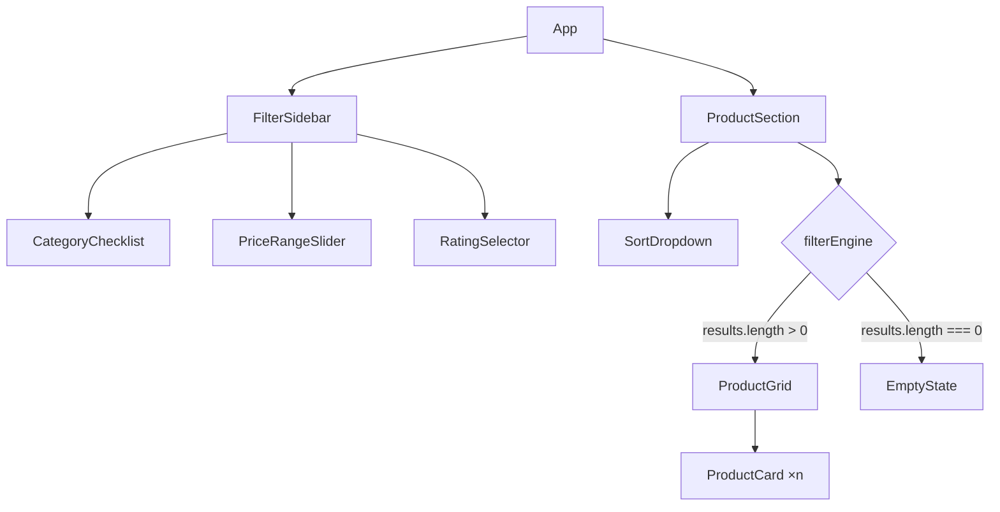

# Design Document: product-multi-filter-sidebar

## Overview

A single-page React application (React + hooks, no external state library) that renders a sticky filter sidebar alongside a responsive product grid. All filtering and sorting happens in-memory on a static mock dataset of ~25 products. Every user interaction triggers an immediate re-render — no submit button, no debounce needed at this scale. The app ships as a standalone `index.html` + `App.jsx` (or a minimal CRA/Vite scaffold), keeping the implementation practical within a 1-hour timeline.

## Architecture

The app follows a flat, single-level component tree with a shared state lifted to the root `App` component. The filter engine is a pure function that lives outside any component.



State flows in one direction: `App` holds `activeFilters` and `sortOrder`; callbacks passed as props update that state; `filterEngine` is called inline during render to derive `visibleProducts`.

## Components and Interfaces

### App

Root component. Owns all state.

```ts
interface ActiveFilters {
  categories: string[];       // [] means "all"
  priceMin: number;
  priceMax: number;
  ratingMin: number | null;   // null means "any"
}

interface SortOrder = "default" | "price-asc" | "rating-desc";

state: {
  filters: ActiveFilters,
  sortOrder: SortOrder,
}
```

Exposes `resetFilters()` which sets filters back to defaults and `sortOrder` to `"default"`.

### FilterSidebar

Props: `filters: ActiveFilters`, `onFiltersChange(patch: Partial<ActiveFilters>): void`, price bounds from dataset (`dataMinPrice`, `dataMaxPrice`).

Renders three children in order: `CategoryChecklist`, `PriceRangeSlider`, `RatingSelector`. Sticky via CSS (`position: sticky; top: 0`).

### CategoryChecklist

Props: `selected: string[]`, `onChange(selected: string[]): void`, `categories: string[]`.

Renders one checkbox per category. Checking adds to array; unchecking removes. No selection = empty array (filter inactive).

### PriceRangeSlider

Props: `min: number`, `max: number`, `value: [number, number]`, `onChange(value: [number, number]): void`.

Dual-handle range slider. Implementation uses two overlapping `<input type="range">` elements styled to overlap, which is the simplest zero-dependency approach. Updates fire on every `input` event (instant).

### RatingSelector

Props: `value: number | null`, `onChange(value: number | null): void`.

Five radio buttons labeled "⭐ 1+", "⭐⭐ 2+", … "⭐⭐⭐⭐⭐ 5". Selecting an already-selected button deselects it (sets to `null`). Implemented by toggling: if the clicked value equals current value, call `onChange(null)`.

### SortDropdown

Props: `value: SortOrder`, `onChange(value: SortOrder): void`.

A `<select>` element with three options. Positioned top-right of the product section via flexbox.

### ProductGrid

Props: `products: Product[]`.

CSS Grid layout: `repeat(auto-fill, minmax(220px, 1fr))`. Renders one `ProductCard` per product.

### ProductCard

Props: `product: Product`.

Displays: image (``), name, price (`$XX.XX`), star rating (filled/empty unicode stars based on `Math.round(product.rating)`).

### EmptyState

Props: `onReset(): void`.

Full-width centered message: "No products match your filters." + "Reset filters" `<button>`.

## Data Models

### Product

```ts
interface Product {
  id: number;
  name: string;
  category: "Electronics" | "Apparel" | "Footwear";
  price: number;       // USD, e.g. 29.99
  rating: number;      // 1.0 – 5.0, one decimal place
  image: string;       // picsum.photos URL, e.g. "https://picsum.photos/seed/prod1/300/200"
}
```

### Mock Dataset (sample, ~25 items)

```ts
const PRODUCTS: Product[] = [
  { id: 1,  name: "Wireless Headphones",   category: "Electronics", price: 79.99,  rating: 4.5, image: "https://picsum.photos/seed/p1/300/200" },
  { id: 2,  name: "Running Shoes",          category: "Footwear",    price: 59.99,  rating: 4.2, image: "https://picsum.photos/seed/p2/300/200" },
  { id: 3,  name: "Cotton T-Shirt",         category: "Apparel",     price: 19.99,  rating: 3.8, image: "https://picsum.photos/seed/p3/300/200" },
  { id: 4,  name: "Bluetooth Speaker",      category: "Electronics", price: 49.99,  rating: 4.7, image: "https://picsum.photos/seed/p4/300/200" },
  { id: 5,  name: "Leather Boots",          category: "Footwear",    price: 119.99, rating: 4.0, image: "https://picsum.photos/seed/p5/300/200" },
  { id: 6,  name: "Denim Jacket",           category: "Apparel",     price: 89.99,  rating: 4.1, image: "https://picsum.photos/seed/p6/300/200" },
  { id: 7,  name: "USB-C Hub",              category: "Electronics", price: 34.99,  rating: 3.9, image: "https://picsum.photos/seed/p7/300/200" },
  { id: 8,  name: "Yoga Pants",             category: "Apparel",     price: 44.99,  rating: 4.3, image: "https://picsum.photos/seed/p8/300/200" },
  { id: 9,  name: "Sneakers",               category: "Footwear",    price: 74.99,  rating: 3.7, image: "https://picsum.photos/seed/p9/300/200" },
  { id: 10, name: "Smart Watch",            category: "Electronics", price: 199.99, rating: 4.8, image: "https://picsum.photos/seed/p10/300/200" },
  { id: 11, name: "Hoodie",                 category: "Apparel",     price: 54.99,  rating: 4.0, image: "https://picsum.photos/seed/p11/300/200" },
  { id: 12, name: "Trail Running Shoes",    category: "Footwear",    price: 89.99,  rating: 4.6, image: "https://picsum.photos/seed/p12/300/200" },
  { id: 13, name: "Laptop Stand",           category: "Electronics", price: 27.99,  rating: 4.2, image: "https://picsum.photos/seed/p13/300/200" },
  { id: 14, name: "Chino Pants",            category: "Apparel",     price: 49.99,  rating: 3.5, image: "https://picsum.photos/seed/p14/300/200" },
  { id: 15, name: "Sandals",               category: "Footwear",    price: 29.99,  rating: 3.9, image: "https://picsum.photos/seed/p15/300/200" },
  { id: 16, name: "Mechanical Keyboard",   category: "Electronics", price: 129.99, rating: 4.9, image: "https://picsum.photos/seed/p16/300/200" },
  { id: 17, name: "Polo Shirt",            category: "Apparel",     price: 34.99,  rating: 4.1, image: "https://picsum.photos/seed/p17/300/200" },
  { id: 18, name: "Slip-On Shoes",         category: "Footwear",    price: 44.99,  rating: 4.0, image: "https://picsum.photos/seed/p18/300/200" },
  { id: 19, name: "Wireless Mouse",        category: "Electronics", price: 39.99,  rating: 4.4, image: "https://picsum.photos/seed/p19/300/200" },
  { id: 20, name: "Bomber Jacket",         category: "Apparel",     price: 109.99, rating: 4.6, image: "https://picsum.photos/seed/p20/300/200" },
  { id: 21, name: "Noise-Cancelling Buds", category: "Electronics", price: 89.99,  rating: 4.3, image: "https://picsum.photos/seed/p21/300/200" },
  { id: 22, name: "High-Top Sneakers",     category: "Footwear",    price: 84.99,  rating: 4.5, image: "https://picsum.photos/seed/p22/300/200" },
  { id: 23, name: "Linen Shirt",           category: "Apparel",     price: 39.99,  rating: 3.6, image: "https://picsum.photos/seed/p23/300/200" },
  { id: 24, name: "Portable Charger",      category: "Electronics", price: 24.99,  rating: 4.1, image: "https://picsum.photos/seed/p24/300/200" },
  { id: 25, name: "Dress Shoes",           category: "Footwear",    price: 134.99, rating: 4.7, image: "https://picsum.photos/seed/p25/300/200" },
];
```

Price range for dataset: $19.99 – $199.99. These values drive the slider's `min`/`max` bounds.

### Filter Engine (pure function)

```ts
function filterEngine(
  products: Product[],
  filters: ActiveFilters,
  sortOrder: SortOrder
): Product[] {
  let result = products;

  // Category filter (inactive when categories array is empty)
  if (filters.categories.length > 0) {
    result = result.filter(p => filters.categories.includes(p.category));
  }

  // Price filter
  result = result.filter(p => p.price >= filters.priceMin && p.price <= filters.priceMax);

  // Rating filter (inactive when ratingMin is null)
  if (filters.ratingMin !== null) {
    result = result.filter(p => p.rating >= filters.ratingMin!);
  }

  // Sort
  if (sortOrder === "price-asc") {
    result = [...result].sort((a, b) => a.price - b.price);
  } else if (sortOrder === "rating-desc") {
    result = [...result].sort((a, b) => b.rating - a.rating);
  }

  return result;
}
```

### Default Filter State

```ts
const DEFAULT_FILTERS: ActiveFilters = {
  categories: [],
  priceMin: 19.99,   // dataset minimum
  priceMax: 199.99,  // dataset maximum
  ratingMin: null,
};
const DEFAULT_SORT: SortOrder = "default";
```


## Correctness Properties

*A property is a characteristic or behavior that should hold true across all valid executions of a system — essentially, a formal statement about what the system should do. Properties serve as the bridge between human-readable specifications and machine-verifiable correctness guarantees.*

### Property 1: Category filter correctness

*For any* product list and any non-empty set of selected categories, every product returned by `filterEngine` must have a category that appears in the selected set. Edge case: when the selected categories array is empty, all products must pass through unchanged.

**Validates: Requirements 3.2, 4.1**

### Property 2: Price filter correctness

*For any* product list and any price range `[min, max]`, every product returned by `filterEngine` must have `price >= min` and `price <= max`. Edge case: when `[min, max]` equals the full dataset range, all products must pass.

**Validates: Requirements 3.3, 4.2**

### Property 3: Rating filter correctness

*For any* product list and any `ratingMin` value in 1–5, every product returned by `filterEngine` must have `rating >= ratingMin`. Edge case: when `ratingMin` is `null`, all products must pass.

**Validates: Requirements 3.4, 4.3**

### Property 4: Combinatorial AND correctness

*For any* product list and any combination of active category, price, and rating filters, every product returned by `filterEngine` must simultaneously satisfy all three filter criteria. No product that fails any one criterion should appear in the output.

**Validates: Requirements 3.1, 3.5**

### Property 5: Default filters are an identity

*For any* product list, calling `filterEngine` with `DEFAULT_FILTERS` and `sortOrder = "default"` must return every product in the original list (same elements, same count). No product should be excluded when all filters are inactive.

**Validates: Requirements 4.4**

### Property 6: Card rendering completeness

*For any* non-empty product list passed to `ProductGrid`, the number of rendered `ProductCard` elements must equal the length of the list, and each card must contain the product's image URL, name, price, and star rating.

**Validates: Requirements 6.1, 6.2**

### Property 7: Price-ascending sort order

*For any* product list sorted with `sortOrder = "price-asc"`, for every consecutive pair of results `(a, b)`, `a.price <= b.price`.

**Validates: Requirements 7.3, 7.5, 7.6**

### Property 8: Rating-descending sort order

*For any* product list sorted with `sortOrder = "rating-desc"`, for every consecutive pair of results `(a, b)`, `a.rating >= b.rating`.

**Validates: Requirements 7.4, 7.5, 7.6**

---

## Error Handling

At this scale (static in-memory data, no network, no user auth) there are no runtime error paths. Defensive measures:

- **PriceRangeSlider**: Clamp `priceMin` to never exceed `priceMax` in the onChange handler (swap values if handles cross). This prevents an inverted range that would yield zero results unexpectedly.
- **filterEngine**: Guard against `undefined`/`null` product fields with safe comparisons (TypeScript types enforce this at compile time).
- **Images**: `` elements include an `onError` handler that falls back to a generic placeholder URL if picsum is unreachable.
- **Empty inventory**: If `PRODUCTS` is somehow empty, `filterEngine` returns `[]`, which triggers the `EmptyState` — that path already works correctly.

---

## Testing Strategy

### Unit Tests (Vitest + React Testing Library)

Focus on specific examples, integration points, and edge cases.

- Render `FilterSidebar` and assert all three control sections appear in DOM order.
- Render `CategoryChecklist` and assert Electronics, Apparel, Footwear checkboxes are present.
- Render `RatingSelector` and assert 5 radio inputs with values 1–5 are present.
- Render `SortDropdown` and assert "Price: Low to High" and "Top Rated First" options exist.
- Render `EmptyState` and assert message text and "Reset filters" button are present.
- Integration: render `App`, select a category, assert grid updates (use `screen.getByText` on product names).
- Integration: render `App` with filters that produce zero results, assert `EmptyState` is shown.
- Integration: click "Reset filters" in `EmptyState`, assert full grid is restored.

### Property-Based Tests (fast-check)

Each property test runs a minimum of 100 iterations. Every test is tagged with a comment referencing its design property.

Tag format: `// Feature: product-multi-filter-sidebar, Property N: <property text>`

**Property 1 — Category filter correctness**
Generate: random subset of `["Electronics", "Apparel", "Footwear"]` (including empty), random shuffle of `PRODUCTS`.
Assert: when selection non-empty, all results have category in selection; when empty, result count equals input count.

**Property 2 — Price filter correctness**
Generate: random `[min, max]` within dataset bounds (ensuring `min <= max`), random product list.
Assert: all results have `price >= min && price <= max`; at full range, all products pass.

**Property 3 — Rating filter correctness**
Generate: random `ratingMin` from `[1, 2, 3, 4, 5, null]`, random product list.
Assert: when non-null, all results have `rating >= ratingMin`; when null, all products pass.

**Property 4 — Combinatorial AND correctness**
Generate: random `ActiveFilters` (all three dimensions active simultaneously), random product list.
Assert: every returned product satisfies category, price, AND rating constraints simultaneously.

**Property 5 — Default filters identity**
Generate: random permutation of `PRODUCTS` (any subset/order).
Assert: `filterEngine(products, DEFAULT_FILTERS, "default")` returns all input products with no exclusions.

**Property 6 — Card rendering completeness**
Generate: random subarray of `PRODUCTS` (length 1–25).
Assert: `ProductGrid` renders exactly `products.length` cards; each card's text content includes the product name, price string, and a star character.

**Property 7 — Price-ascending sort**
Generate: random `ActiveFilters`, random product list.
Assert: with `sortOrder = "price-asc"`, result is non-decreasing by `price`.

**Property 8 — Rating-descending sort**
Generate: random `ActiveFilters`, random product list.
Assert: with `sortOrder = "rating-desc"`, result is non-increasing by `rating`.
